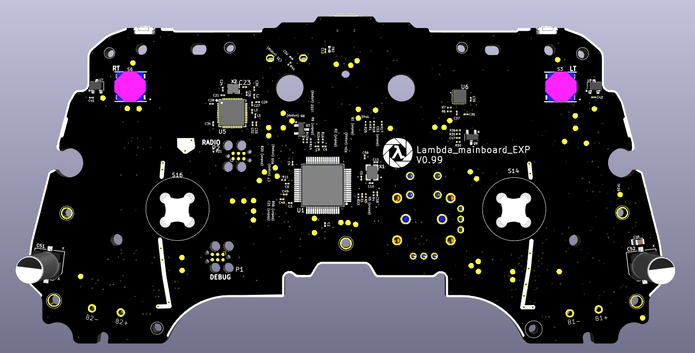

# The Lambda Project

Welcome to the Lambda Project! 
This project is aimed to fully reverse engineer the hardware on the steam controller motherboard for modding and repair. The main goal is to be able to fabricate a drop in replacement motherboard for the controller. Either through transplanting original components or using brand new replacements. I have named this board the 'Lambda_mainboard_EXP' (experimental). This project will open numerous opportunities for the modding community and the steam controller community. Bringing life back to broken units or fully integrating your upgrades/mods onto this board. To give some examples: USB-C mod, Better buttons, more LEDs, rechargeable battery system, a proper D-Pad, second Joystick, and anything else the community comes up with. I also believe that this could be the groundwork for a community made Steam Controller 2, such as one based off the Steam Deck since the controls are almost exact. 

# I won't be releasing any gerber files until version 1 is complete. 

# Disclaimer - Please Read:
I am not a professional. This project is not finished. Version 1.0 will be the first fully working replacement PCB. Why am I announcing an unfinished project? As the Steam Controller 9 year anniversary is tomorrow as of the time of this writing. I saw it fit to announce and update what I've been working on. This project is aimed to be open source. All files and documentation will be uploaded for free. Please take this into consideration before modding your controller as I am not responsible for any damage done to it.

# PCB Editor:
This project was initially made with EasyEDA but everything has been ported to KiCad version 8. All the KiCad files will be provided.

# KiCad Project Files:
Since the project is over 25MB and GitLFS doesn't seem to work the entire project will be here on google drive: [Steam_Controller_KiCad](https://drive.google.com/drive/folders/1pgKrxKx-PQnyL5enbXCNOBBvkrO6b2vu?usp=sharing)

# PCB CAD File:
There is a new folder that has a [3D model of the Lambda_mainboard](./PCB_CAD).

# Images and Schematic

Lambda_mainboard_EXP V0.7

The current version is V0.8 as of 2-17-2025. Most basic connections have been reverse engineered such as the buttons, track-pads, joystick, USB, and partial for the microcontrollers. The power circuit is roughly 90% complete with power traced all the way to the main processor.

Lambda_mainboard_EXP V0.6-4 In Editor
Most of the traces are made with AutoRouter with some manual adjustment. Also it just looks really cool.

Lambda Schematic V0.4 Screenshot -Inverted because dark mode :).
A pdf can be found here [lambda_schematic.pdf](/Lambda_Project/lambda_schematic_V0.8.pdf).

Lambda_mainboard_EXP V0.1
The very first iteration of the project.  

