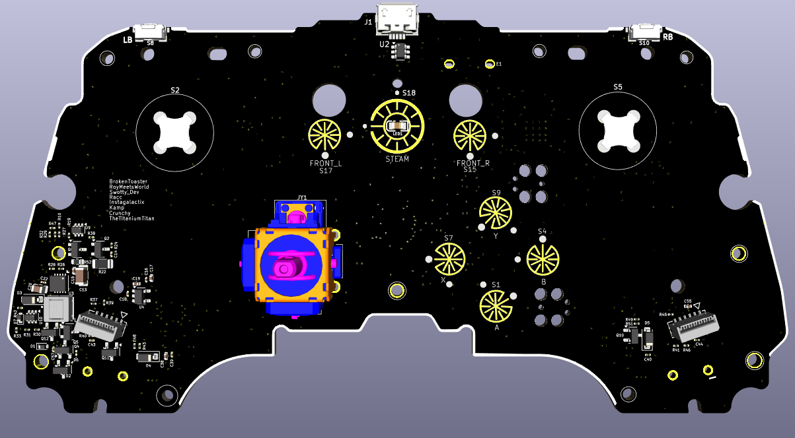
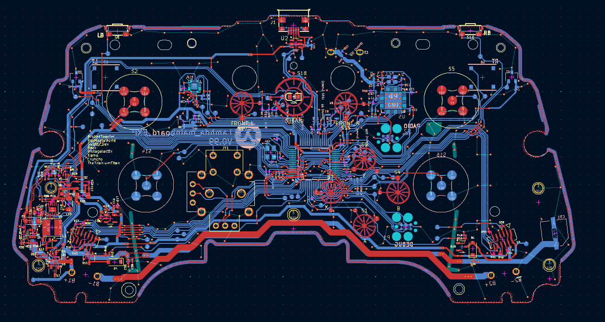

# The Lambda Project

Welcome to the Lambda Project!
This project is aimed to fully reverse engineer the hardware on the steam controller motherboard for modding and repair. The main goal is to be able to fabricate a drop in replacement motherboard for the controller. Either through transplanting original components or using brand new replacements. I have named this board the 'Lambda_mainboard_EXP' (experimental). This project will open numerous opportunities for the modding community and the steam controller community. Bringing life back to broken units or fully integrating your upgrades/mods onto this board. To give some examples: USB-C mod, Better buttons, more LEDs, rechargeable battery system, a proper D-Pad, second Joystick, and anything else the community comes up with. I also believe that this could be the groundwork for a community made Steam Controller 2, such as one based off the Steam Deck since the controls are almost exact.

# I won't be releasing any gerber files until version 1 is complete.

# Disclaimer - Please Read:

I am not a professional. This project is not finished. Version 1.0 will be the first fully working replacement PCB. Why am I announcing an unfinished project? As the Steam Controller 9 year anniversary is tomorrow as of the time of this writing. I saw it fit to announce and update what I've been working on. This project is aimed to be open source. All files and documentation will be uploaded for free. Please take this into consideration before modding your controller as I am not responsible for any damage done to it.

# KiCad Project Files:

KiCad source files will be available in the releases along with datasheets for each component: [Steam_Controller_KiCad](https://github.com/MichaelZaugg/OpenSteamController-Continued/releases)

# PCB CAD File:

There is a new folder that has a [3D model of the Lambda_mainboard](./PCB_CAD).

# Images and Schematic

**Lambda_mainboard_EXP V0.99**

The current version is V0.99 as of 7-18-2025. All that is left is clean up, sourcing parts, and ordering our first prototype.

**Lambda_mainboard_EXP V0.99 In Editor**

**Lambda Schematic V0.99** -Inverted for our eyes.
**A pdf can be found here** [lambda_schematic.pdf](/Lambda_Project/lambda_schematic_V0.99.pdf).

**Lambda_mainboard_EXP V0.1**
The very first iteration of the project.

## Special Thanks

Shoutout to the team members who helped made this possible (Discord Usernames):

BrokenToaster

RoyMeetsWorld

Swotty_Dev

Racc

Kamp

Crunchy

Instagalactix

TheTitantiumTitan
