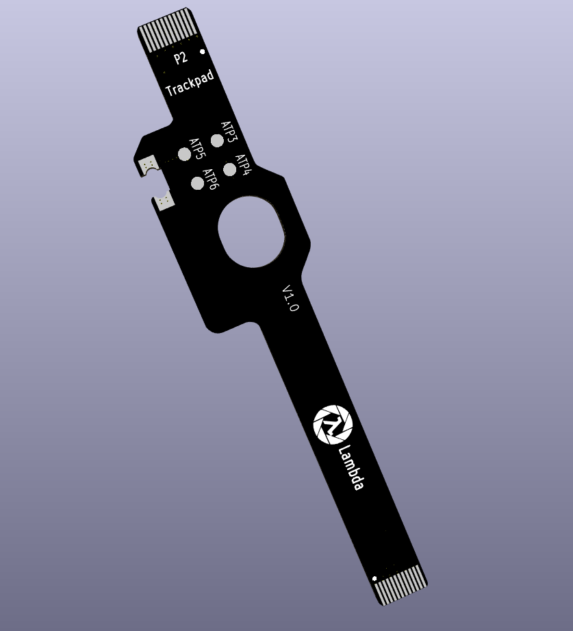
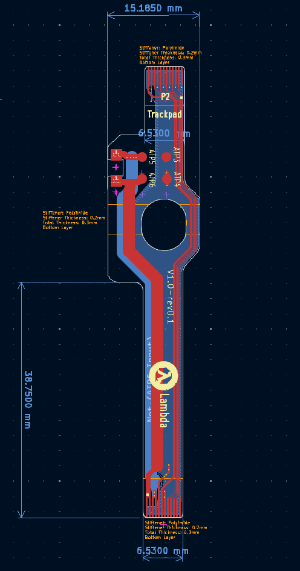
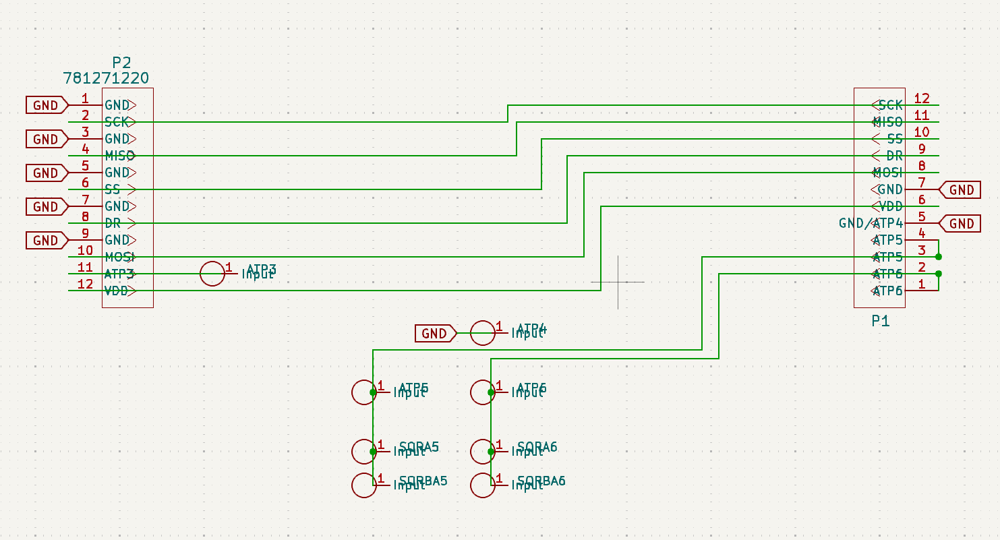

# Lambda Ribbon Cable

This is a drop in replacement for the ribbon cable in the Steam Controller.

[You can find the release here](https://github.com/MichaelZaugg/OpenSteamController-Continued/releases/tag/RibbonCable)

Included is a Gerber zip file along with the KiCad project files.

I ordered mine off of JLCPCB [as a Flex Cable](https://cart.jlcpcb.com/quote?orderType=1&plateType=7&stencilLayer=2&stencilWidth=100&stencilLength=100&spm=Jlcpcb.Homepage.1013)
Please look at the JLCPCB Settings included (it's a screenshot of what I had)

