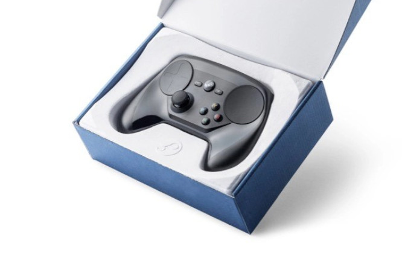
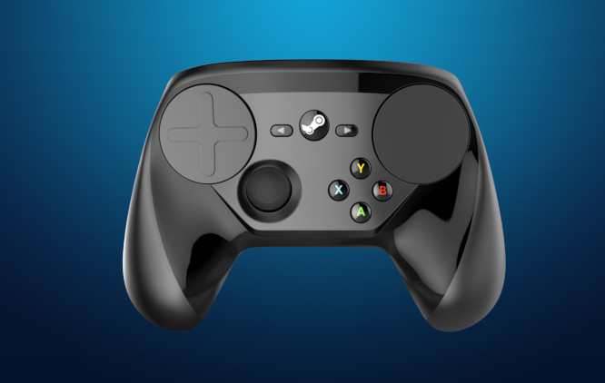
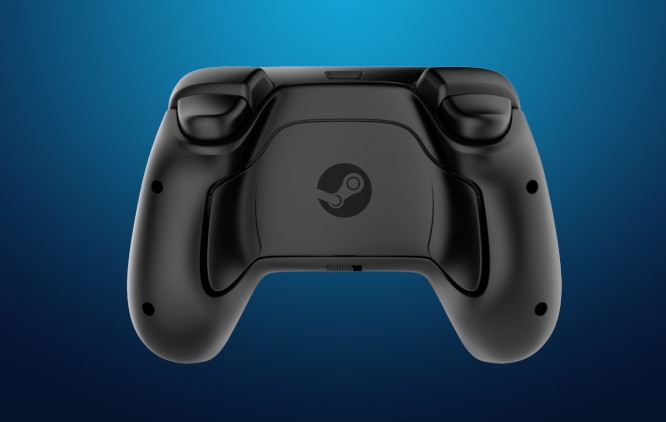

# Open Steam Controller - Continued

Welcome to the Open Steam Controller Project!

This project is a fork of the [original Open Steam Controller](https://github.com/greggersaurus/OpenSteamController) by [Greg Gluszek](https://github.com/greggersaurus).

I hope to continue and improve upon the already amazing work done to deconstruct, document,
repurpose, and expand upon the Steam Controller firmware and hardware. As well as
provide a page of mods for those wanting to improve their own controllers with all
the information they need.

# The Steam Controller

The Steam Controller is a video game controller released by Valve Corporation
on November 10, 2015. This was part of Valve's initiative to give PC gamers the
option of a console-like experience.

Keeping some aspects familiar to modern video game controllers (i.e. a left analog stick,
four face buttons, two shoulder, and bumper buttons) while also changing up some of the
norms that we have come to expect (i.e. replacing the directional pad
and right analog stick with trackpads).

Additional details on the controller can be found on the official
[Product Page](https://store.steampowered.com/app/353370/Steam_Controller/)

# [Project Summary](./ProjectSummary.md)

Read about how this project came to be and the mind behind it.

# [Mods](./Mods/)

Take a look at some of the current mods for the Steam Controller in this directory.

# Notice and Warning

Please recognize that by utilizing any part of this project you are doing so at
your own risk. This is a reverse engineering effort and [we] make no claims to
have a complete understanding of the hardware [that we write] custom or modified
firmware for. Hopefully the testing [we] perform before publishing our findings and
modifications will prevent damage to your Steam Controller or anything you may
connect your Steam Controller to (i.e. the Nintendo Switch). However, [we] cannot
guarantee that.

Also please note this is being shared primarily for educational purposes. While
this may allow a user to do things such as use the Steam Controller on the
Nintendo Switch, please recognize that this is almost definitely going to be
coming with trade-offs compared to officially supported hardware and firmware.

Finally note that [we] say all of this with the hope of not discouraging anyone.
Please dive in and get your hands dirty. Just please be aware that there is a
(hopefully) very small, but non-zero, chance that a mistake could lead to
[bricked or broken hardware](./LoadingFirmware.md).

# Subproject Example

This section gives brief outlines and demonstrations (if applicable) of the
major efforts of this project. Further details on each Subproject can
be found in their respective directories.

## [Firmware](./Firmware/)

The work in this directory is geared towards creating a completely custom firmware
build for the Steam Controller. This project can be configured to have the
controller act as a development system that allows for querying peripherals
and exploring or verifying system behaviors. Additionally the project can
be configured for more practical purpose, such as behaving like a wired
Nintendo Switch controller.

Below are some videos demonstrating the different firmware builds:

Open Steam Controller: Nintendo Switch

Open Steam Controller: Development Board

# Contributing

This is an open source project, so please make use of this however you would
like (as long as it does not violate any licenses stated within).

If you would like to offer contributions back to this repo that would be great.
That could come in the form of issues/discussions on how this could be more
user friendly or by adding features or support that is not yet there.

Note that there are TODO documents for each Subproject. The idea
is to outline goals I would like to accomplish. If you want to help with any of
these that would be awesome. It would be even more awesome if you started a
conversation regarding your intentions so as to limit the chances of duplicated
effort or incongruous designs.

# Bugs and Issues

We will do our best to provide easy to use and robust software. However, there
will still most likely be bugs. If you find a bug, please report it.

The best way to report a bug is to use the Issues tab on GitHub.

When reporting a bug/issue, please make sure to provide sufficient details. Key
details to include are:

* Exactly what steps did you take?
* Can you reproduce the error by following your own steps?
* Do you have any files that make the bug occur (i.e. specific .musicxml file)?

# Resources and Influences

This section lists some projects that influenced this project, as well as links
to some resources that may continue to be helpful to stay current on.

## [Pilatomic Steam Controller Singer](https://gitlab.com/Pilatomic/SteamControllerSinger)

* Example of using the haptics to play music.
* Example of PC side code written in C using libusb.
* Allows for playing songs of any length, but at cost of controller being occupied by Singer software.

## [HID Joy-Con Whispering](https://github.com/shinyquagsire23/HID-Joy-Con-Whispering)

* Application for communicating with Pro Controller via USB HID.
* Helpful for Switch Faux Controller development to get USB communications in place.

## [Nintendo Switch Reverse Engineering](https://github.com/dekuNukem/Nintendo_Switch_Reverse_Engineering)

* Notes on Reverse Engineering of Nintendo Switch Controllers.
* Helpful details on HID communications with Pro Controller.

## [Standalone Steam Controller Driver](https://github.com/ynsta/steamcontroller)

* Source for breaking down some USB commands.
* Goal of this project is to be able to use Steam Controller as a game controller outside of the Steam platform.

## [Steam Controller Update News](http://store.steampowered.com/news/?appids=353370)

* Useful to get an idea of what changed from official firmware to firmware release.

## [UnBricking Steam Controller (Manual Firmware Update, Rollback)](https://steamcommunity.com/sharedfiles/filedetails/?id=572740074)

* Step by step guide on how to manually change the Steam Controller firmware.
* Much of this information is captured in [Loading Firmware](./LoadingFirmware.md).
  * [Loading Firmware](./LoadingFirmware.md) presents the information in the context of how it applies to Open Steam Controller Project and its Subprojects.

## Steam Communities

* [Official Group](http://steamcommunity.com/games/353370#announcements/detail/901091250587237164)
* [Custom Sounds Discussion](https://steamcommunity.com/app/353370/discussions/0/458607699626517823/)

# TODO

While a lot has been accomplished in this project thus far, there is still so much that
can be done with the Steam Controller (especially given the groundwork that has
been laid up to this point). In order to capture and track these ideas TODO documents
have been made for each Subproject. A good place to start is the top-level
[TODO Document](./TODO.md). This covers the highest level goals for the project
while providing links to Subproject specific TODOS.
